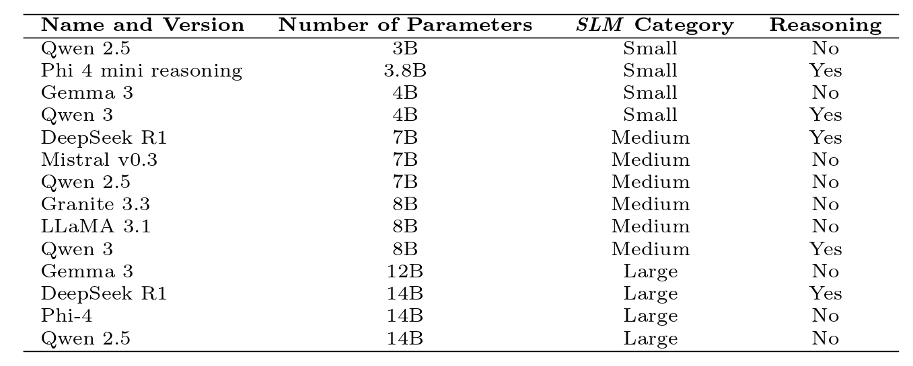
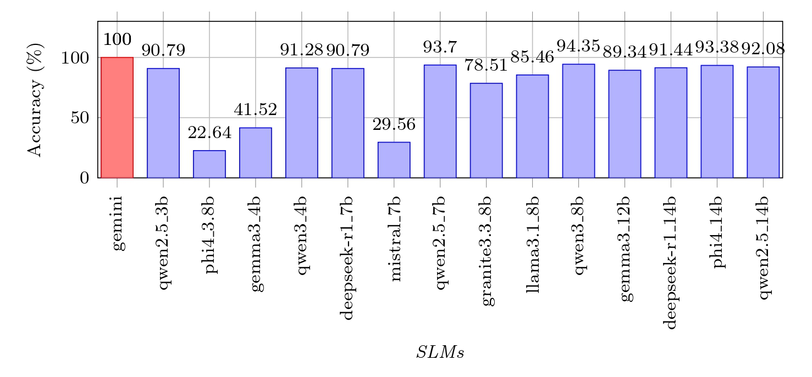
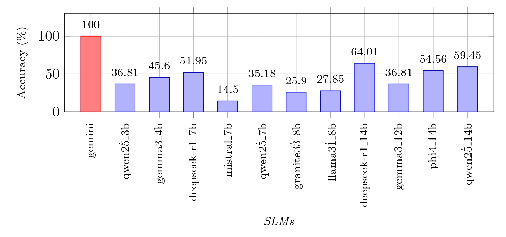
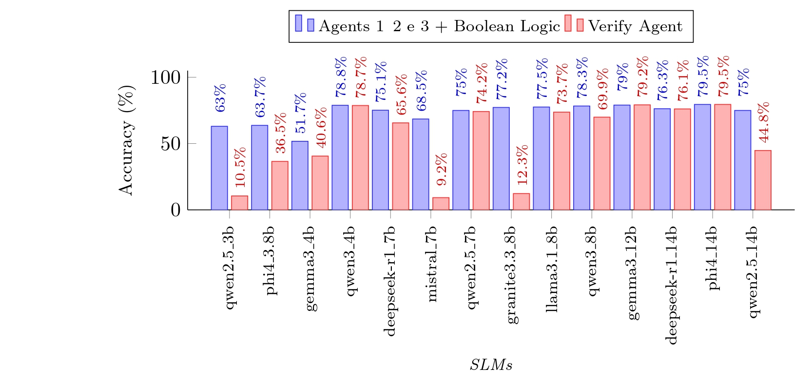
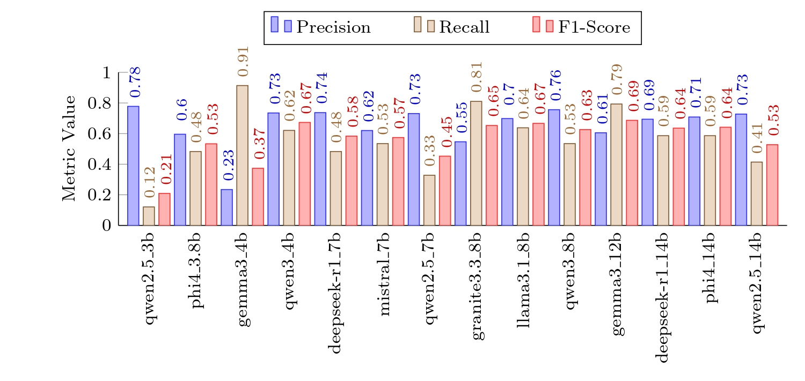

# Do SLM agents screen papers as well as LLMs?

## Authors: [João Goulart Mendes de Freitas Filho](mailto:joao.filho63204@alunos.ufersa.edu.br) e [Sílvio Roberto Fernandes de Araújo](mailto:silvio@ufersa.edu.br)

 
### Universidade Federal Rural do Semi-Árido (UFERSA), Mossoró - RN - Brasil.

### Departamento de Computação
### Group of Embedded Systems and Computer Architecture 

### [ENIAC 2025 - Encontro Nacional de Inteligência Artifial E Computacional](https://bracis.sbc.org.br/2025)

# Abstract

Systematic Literature Review (SLR) is a important method for summarizing scientific knowledge, especially in evidence-based research. However, this process is complex and time-consuming. One of the most critical and time-demanding steps is article screening, where a large percentage of initially retrieved works are discarded.


This work investigates the use of Small Language Models (SLMs), executed locally, for the task of article screening—an area with few studies available, despite the promising results obtained with commercial Large Language Models (LLMs). We analyzed three distinct approaches using SLMs and compared them with a commercial LLM as the baseline.


The results demonstrate that SLMs can achieve good performance when tasks are simplified and divided into subtasks. The Qwen 3-8B model achieved an accuracy of up to 94.35%. In a multi-agent approach, Phi 4-14B and Qwen 3-4B achieved, respectively, 79.5% and 78.8% accuracy compared to the commercial LLM.

# Methodology

In this study, several open-source SLMs were used, executed through the Ollama platform in their 4-bit quantized versions. The LangChain framework was employed to orchestrate the models, their prompts, and interactions.


## Tabela de SLMs



The experimentation was based on an SLR about synthetic data generation for human activity recognition. Three inclusion criteria were defined for screening 619 articles selected from Springer, IEEE, ACM, and Elsevier databases.


As três abordagens implementadas foram:

1.  **Single Agent (2 classes):** A single agent classified the articles as "included" or "excluded".

2.  **Single Agent (5 classes):** A single agent classified the articles into "included", "excluded 1", "excluded 2", "excluded 3" or "undetermined".

3.  **Divide and Cnquer & Multi-agent:** Three agents analyzed each of the inclusion criteria individually, and a boolean logic combine their answers to final decision.


## Used Prompts

Below are the **detailed prompts** for each approach.


### Approach 1: Single Agent (2 classes)

```
You are an expert in article screening and should follow the inclusion criteria described below:
The inclusion criteria are:
1. The article proposes data synthesis;
2. The article uses generative neural networks to generate synthetic data;
3. The article addresses the recognition of human activities, regardless of whether the term "Human Activity Recognition" is explicitly used.

Your goal is to read the title and abstract of an article, and then provide a response indicating the classification (’INCLUDED’ or ’EXCLUDED’) and a brief justification for your classification. The article under review should be classified as INCLUDED only if ALL inclusion criteria are met, otherwise it should be classified as EXCLUDED.

Your output should be a JSON object with two keys: "classification" and "justification".
For example:
{"classification": "INCLUDED", "justification": "This article meets all three inclusion criteria."}
or
{"classification": "EXCLUDED", "justification": "This article does not meet inclusion criterion 1 as it does not propose data synthesis."}

Title: {title}
Abstract: {abstract}
```

### Approach 2: Single Agent (5 classes)

```
You are an expert in article screening and should follow the inclusion criteria described below:
The inclusion criteria are:
1. The article proposes data synthesis;
2. The article uses generative neural networks to generate synthetic data;
3. The article addresses the recognition of human activities, regardless of whether the term "Human Activity Recognition" is explicitly used.

Your goal is to read the title and abstract of an article and then provide a response indicating the classification (’INCLUDED’, ’EXCLUDED 1’, ’EXCLUDED 2’, ’EXCLUDED 3’ or ’UNDETERMINED’) and a brief justification for your classification. 

The article under review should be classified as ’INCLUDED’ only if ALL inclusion criteria are met; otherwise, it should be classified as ’EXCLUDED 1’ if it does not meet inclusion criterion 1, ’EXCLUDED 2’ if it does not meet inclusion criterion 2 and ’EXCLUDED 3’ if it does not meet inclusion criterion 3. If you cannot classify it in any of the above, classify it as ’UNDETERMINED’.

Your output should be a JSON object with two keys: "classification" and "justification".
For example:
{{"classification": "INCLUDED", "justification": "This article meets all three inclusion criteria because it proposes data synthesis using generative neural networks for human activity recognition."}}
or
{{"classification": "EXCLUDED 1", "justification": "This article does not meet inclusion criterion 1 as it does not propose data synthesis."}}
or
{{"classification": "UNDETERMINED", "justification": "For this article I cannot determine whether it can be included or does not meet one of the criteria for exclusion."}}

Title: {title}
Abstract: {abstract}
```

### Approach 3: Multi-agent

**Prompt for the Criterion-Checking Agents):**

```
You are an expert in screening scientific articles for literature review on the topic: Human Activity Recognition (HAR).

You must follow the following criteria to indicate whether it should be included in a literature review.
Inclusion Criteria:
{inclusion_criteria}

Your task is to classify the article strictly according to the above criteria.
- If the article perfectly meets the inclusion criteria, classify it as "TRUE".
- If you are certain that the article does not meet the inclusion criteria, classify it as "FALSE".
- If there is insufficient information or you have doubts whether the article meets the inclusion criteria, classify it as "UNDETERMINATED".

Be clear and decisive. Avoid "UNDETERMINATED" unless absolutely necessary.
Your final answer should be ONLY a JSON object with the keys: "classification" and "justification".

Example output for you to follow:
{"classification": "TRUE", "justification": "The article proposes an approach to data synthesis."}
{"classification": "FALSE", "justification": "The article uses synthetic data but does not propose its synthesis."}
{"classification": "UNDETERMINATED", "justification": "There is not enough information in the title and abstract to determine."}

Now analyze the title and abstract of the following article and classify it.

Title: {title}
Abstract: {abstract
```

*(Note: `{incluscion_criteria}` was replaced with each specific criterion for each of the three criterion-checking agents)*


# Results

The results indicate that **Approach 1** achieved the highest accuracy, with highlights for the models Qwen3_8b (94.35%), Qwen2.5-7b (93.7%), and Phi4_14b (93.38%). However, the lack of traceability in the exclusions makes this approach insufficient for the SLR process.





**Approach 2** showed a drop in accuracy compared to the first, with the best performances from Deepseek-r1_14b (64.01%) and Qwen2.5-14b (59.45%).




**Approach 3**, the "divide and conquer" strategy, showed that the final verification task became complex for an SLM. The best F1-Scores were obtained by the Gemma3_12b, Llama3.1_8b, and Qwen3_4b models. However, overall accuracy was lower compared to Approach 1, with Phi4_14b and Qwen3_4b achieving the best results (79.5% and 78.8%, respectively).




## Other metrics for evaluating approach 3




# Citation

```
@inproceedings{freitasfilho2025slm,
  title={Do SLM agents screen papers as well as LLMs?},
  author={Freitas Filho, João Goulart Mendes and Fernandes, Síilvio R.},
  booktitle={Anais do Encontro Nacional de Inteligência Artificial e Computacional},
  year={2025},
  organization={Sociedade Brasileira de Computação}
}
```

# Contact

For more information, please contact the authors:


* **João Goulart Mendes de Freitas Filho:** joao.filho63204@alunos.ufersa.edu.br

* **Sílvio R. Fernandes:** silvio@ufersa.edu.br